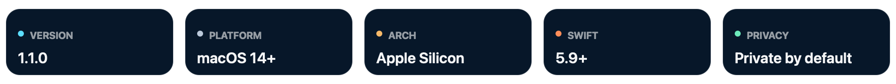

# Flow for macOS

### 一键连接，状态清楚，配置留在本地。

**简体中文** · [繁體中文](docs/README.zh-TW.md) · [English](docs/README.en.md) · [日本語](docs/README.ja.md) · [한국어](docs/README.ko.md) · [Español](docs/README.es.md) · [Français](docs/README.fr.md) · [Deutsch](docs/README.de.md) · [Português](docs/README.pt-BR.md) · [Русский](docs/README.ru.md) · [العربية](docs/README.ar.md) · [हिन्दी](docs/README.hi.md) · [Bahasa Indonesia](docs/README.id.md)

Contact: **Jacksun** · [qinji@jack-sun.com](mailto:qinji@jack-sun.com)

  

  
  

## 这是什么

Flow 是只为 macOS 打造的轻量连接客户端。它把底层核心、节点验证、路由与系统代理放在后台，只把真正重要的信息留在前面：**是否已连接、流量经过哪里、系统代理是否打开、连接是否真实可用。**

它与 NetFlow 是两个独立项目：Flow 面向日常的一键连接；NetFlow 面向更高级的管理需求。

## 工作方式

1. 读取你本机缓存的节点，或你自行配置的私有订阅地址。
2. 启动临时本地代理验证实际连通性，而不只是测试端口。
3. 通过本地核心提供 SOCKS5 与 HTTP 代理。
4. 由你决定是否启用 macOS 系统代理。

## 隐私边界

仓库公开的是界面、应用逻辑、构建脚本和无效示例；真实服务器地址、订阅链接、UUID、密钥与令牌应始终保留在你自己的本机配置中。克隆本仓库不会获得作者的任何私有网络访问权限。

## 快速开始

- 从 [Releases](https://github.com/sunqinji666-dotcom/flow/releases/latest) 下载最新 macOS Apple Silicon 版本。
- 源码运行需要 macOS 14+ 与 Swift 5.9+：`cd Sources/Flow && swift run`。
- 私有订阅地址由你自行写入本机设置；仓库不包含可用凭据。

详细使用、构建与故障定位请阅读 [中文完整说明](docs/README.zh-CN.md)。

## 项目资料

- [安全策略](SECURITY.md)
- [更新记录](CHANGELOG.md)
- [私有配置示例](PRIVATE_CONFIG.example.md)

## 开源许可

本项目采用 [MIT License](LICENSE) 开源。欢迎使用、学习、修改与再发布；请保留原始许可证与版权声明。
