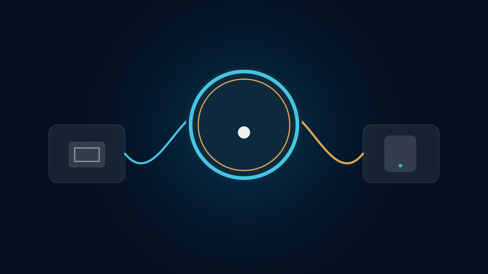

# Flow for macOS

> 一个按钮，连接或断开。

Flow 是一款只为 macOS 做的轻量代理客户端。它不想做成复杂的“网络控制台”，也不把 Android、Windows 或其他实验版本混在这里。打开窗口，看到一个按钮；需要连接时点一下，需要停止时再点一下。



## Flow 是什么？

Flow 把 Xray 放在后台，把普通人真正关心的事情放在前面：

- 现在有没有连上？
- 当前用的是哪个节点？
- 系统代理有没有打开？
- 本地端口是多少？

高级配置仍然存在，但不会一打开就把你淹没在名词里。

## 工作方式

```text
macOS → Flow 界面 → 本地 SOCKS5 / HTTP 端口 → Xray → 私有节点
```

同一 Wi‑Fi 下，其他设备也可以按需使用 Mac 提供的代理端口。

## 安全边界

这个公开仓库只保存程序源码和示例配置，不保存真实节点信息。真实 IP、UUID、Reality 公钥、订阅地址和 token 都应该放在本地私有配置中。

源码里的默认节点是占位符：

```text
example.com
00000000-0000-0000-0000-000000000000
REPLACE_WITH_PRIVATE_REALITY_PUBLIC_KEY
```

配置远程节点地址：

```bash
defaults write com.jacksun.flow FlowRemoteNodesURL "https://你的私有域名/flow/nodes.json"
```

## 本地运行

要求：macOS 14+、Swift 5.9+。

```bash
cd Sources/Flow
swift run
```

## 打包 App

```bash
./Scripts/build_app.sh
```

如果要把 Xray core 放进应用包，在本机传入路径：

```bash
FLOW_CORE_SRC="/你的本地路径/Resources/Cores" ./Scripts/build_app.sh
```

构建结果：`build-output/Flow.app`

## 当前版本

`v1.1.0` · 纯 macOS 整理版

这一版明确只维护 macOS Flow，不再把 NetFlow 或其他平台实验代码放进来。

## 目录

```text
Sources/Flow/       SwiftUI 主程序
Scripts/            macOS 构建脚本
assets/             App 图标和项目概念图
FLOW_DESIGN_DOC.md  产品设计说明
SECURITY.md         安全边界
```

## License

暂未指定开源许可证。公开内容用于个人项目展示与后续开发。
